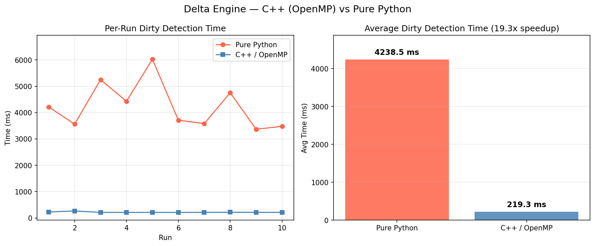

# PyTorch Incremental Checkpoint Engine

A drop-in replacement for `torch.save()` that implements delta-based incremental checkpointing, only writing changed parameters above a threshold and skipping untouched layers entirely.

The dirty-detection hot path is parallelized with a C++/OpenMP extension, achieving a **19x speedup** over the pure-Python fallback on a Llama 3.2 1B model.

| Backend | Avg | Median | Speedup |
|---|---|---|---|
| Pure Python | 5,304 ms | 5,324 ms | 1.0x |
| C++ / OpenMP (4 threads) | 279 ms | 209 ms | **19.0x** |

> Llama 3.2 1B, 1.5B parameters, 147 tensors, Apple M4



## Why

Full checkpoint saves are expensive. For large models, they block training for seconds or tens of seconds every N steps. This project unlocks the ability to checkpoint far more frequently without meaningful training throughput loss, since only the parameters that actually changed get written to disk.

Useful when:
- **Training is frequently interrupted** (preemptible cloud instances, HPC job limits) and you need fine-grained recovery points without the cost of full saves
- **Fine-tuning large models** where most weights are frozen. Unchanged layers are skipped entirely, making saves a fraction of the full cost
- **Hyperparameter sweeps or multi-run experiments** where you want dense checkpoints for analysis but disk I/O is a bottleneck
- **Long training runs** where checkpoint overhead compounds. Saving 10x more often for the same I/O budget means you lose far less work on failure

## Architecture

- **Delta detection**: relative L2 norms `‖current − base‖ / ‖base‖` per layer, parallelized via OpenMP
- **Content-addressed storage**: SHA-256 + zstandard, git-object layout; identical tensors stored once
- **Async writes**: daemon thread with bounded queue (max 2 pending); training loop only blocks for delta compute and CPU copy
- **Lifecycle GC**: prunes versions outside `keep_last_n` / `keep_best_n` and deletes orphaned blobs after every save

## Tests

```bash
pytest tests/ -v   # 87 tests
```

## Benchmarks

```bash
python benchmarks/bench_delta.py --repeats 10
```
